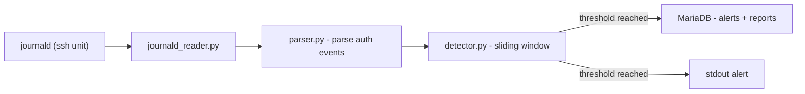

# iia_detect-bruteforce-ssh


School project (Blue Team) about an SSH brute-force detector that reads `journald` logs on Debian 13, applies a sliding window detection rule, and stores alerts in a MariaDB database. Detection only - no remediation, no blocking.

> **Limitations:** Debian 13 only, `journald` as the sole log source, single IP-based detection rule, MariaDB/MySQL only.

---

## Overview



### Detection rule

- **Threshold:** 5 failed authentication attempts from the same IP
- **Window:** 120 seconds
- **Action:** insert alert and JSON report in the database, print to stdout

### Project structure

```
iia_detect-bruteforce-ssh/
├── main.py                    - Entry point (CLI: --follow / --once)
├── config_exemple.yaml        - Config template
├── .env_exemple               - Environment variables template
├── src/ssh_detector/
│   ├── config.py              - Config loader
│   ├── journald_reader.py     - journald JSON stream reader
│   ├── parser.py              - SSH auth event parser
│   ├── detector.py            - Sliding window detection logic
│   └── db.py                  - Database access (host, rule, alert, report)
├── tests/
│   └── test_detector.py
└── docs/
    ├── docs_md/               - Setup and architecture notes
    └── docs_plantuml/         - Merise and UML diagrams (MCD, MLD, MCT, class, activity, usecase)
```

---

## Usage

### Prerequisites

- Debian 13 with `openssh-server` running
- Python 3 with a virtual environment
- MariaDB / MySQL with a dedicated user
- `sudo` access to read `journald`

### Setup

```bash
# Copy and fill the config file
cp config_exemple.yaml config.yaml

# Copy and fill the environment file
cp .env_exemple .env

# Install dependencies
pip install -r requirements.txt
```

### Run

```bash
# Continuous mode - follows journald in real time
sudo -E .venv/bin/python main.py --follow

# One-shot mode - reads current logs then exits (suitable for cron)
sudo -E .venv/bin/python main.py --once
```

### Test the detection

```bash
# Trigger failed SSH attempts from the same machine
ssh fakeuser@localhost
```

Then check:
- Events appear in `journalctl -u ssh`
- An alert is printed to stdout after the threshold is reached
- The alert is stored in the database

---

## Specificities

### Configuration

`config.yaml`:

```yaml
journald:
  unit: ssh
  follow: true

detection:
  threshold: 5        - Number of failed attempts to trigger an alert
  window_seconds: 120 - Detection window in seconds

db:
  host: "${DB_HOST}"
  user: "${DB_USER}"
  database: "${DB_NAME}"

host:
  adresse_mac: "00:00:00:00:00:00"
  adresse_ip: "127.0.0.1"
  os: "Debian 13"
```

`.env`:

```
DB_HOST=127.0.0.1
DB_USER=ssh_user
DB_PASSWORD=CHANGE_ME
DB_NAME=ssh_bruteforce
```

### School deliverables (Gestion des SI)

Merise and UML models are available in `docs/docs_plantuml/`:

| Diagram | Format |
|---|---|
| MCD - Conceptual data model | PNG |
| MLD - Logical data model | PNG |
| MPD - Physical data model | SQL |
| MCT - Conceptual processing model | PNG |
| Class diagram | PNG |
| Activity diagram (`--follow` mode) | PNG |
| Use case diagram | PNG |

Regenerate diagrams from sources:

```bash
plantuml -tpng docs/docs_plantuml/*.puml
```

### Stack and tooling

| Tool | Usage |
|---|---|
| Python 3 | Main language |
| MariaDB / MySQL | Alert storage |
| journald | Log source |
| pytest | Unit tests |
| Ruff | Linting and formatting |
| PlantUML | UML and Merise diagrams |
| Draw.io | MCD / MLD / MPD schemas |
| Doxygen | Code documentation (gitignored) |
| GitHub Actions | CI - lint and tests |

---

## License

MIT
